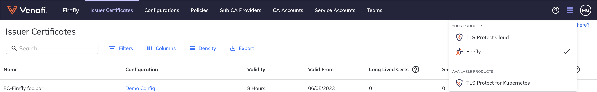
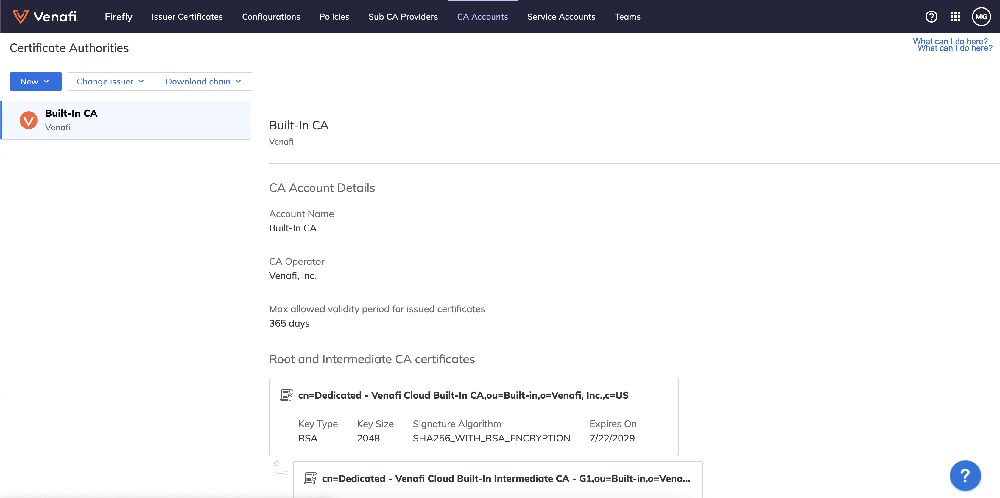
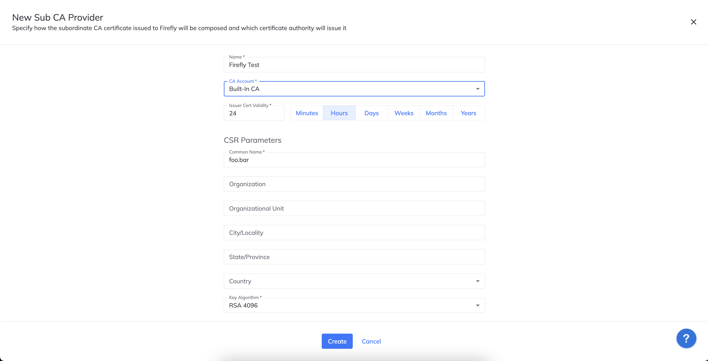
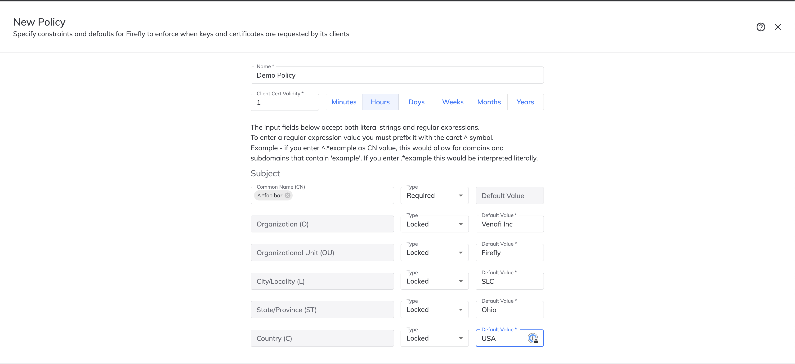
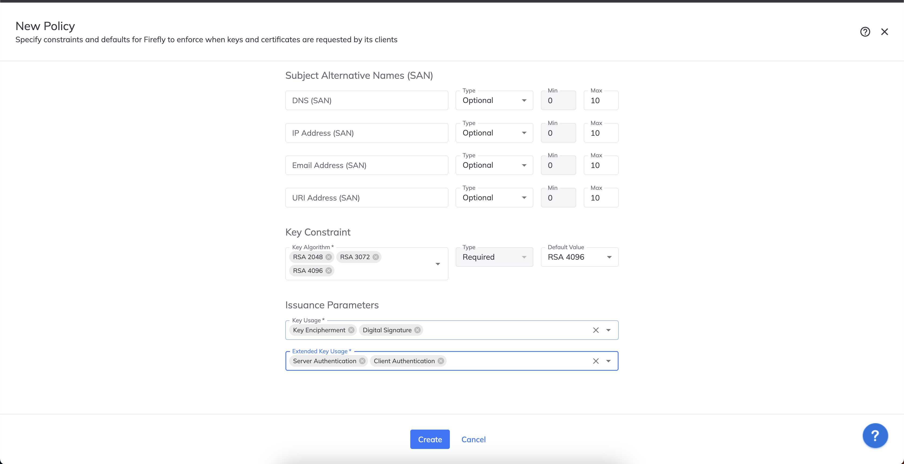
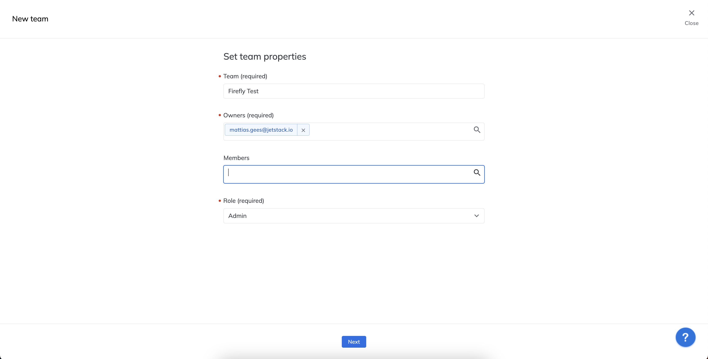
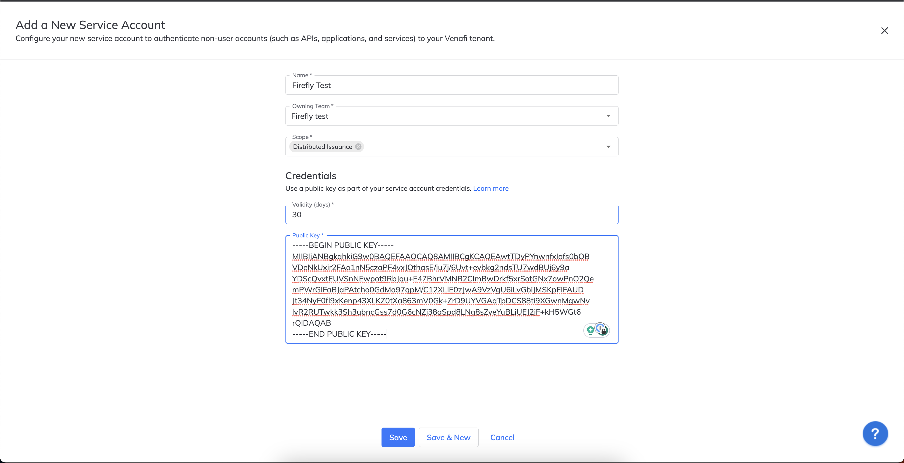

# Getting started with Firefly locally

Firefly is the ultra high-speed, versatile and lightweitgh Cloud Native Machine Identity issuer. This getting started guide will allow you to run it locally to quickly get up and running.

## Prerequisites

* Docker
* Docker-Compose
* [gRPCurl](https://github.com/fullstorydev/grpcurl#readme)
* Firefly activated in your TLS Protect Cloud account

## TLS Protect Cloud

Go to your TLS Protect Cloud [account](https://ui.venafi.cloud/) and select `Firefly` on the top right corner



### CA Accounts

Go to [CA Account](https://docs.venafi.cloud/firefly/ca-accounts/) on the top and verify you have the `built-in CA`. For production you will either use the `Venafi Zero Touch PKI` or `Microsoft AD CS`, but for demo purposes the `built-in CA` suffices



### Sub CA Provider

Now we need to setup a [Sub CA Provider](https://docs.venafi.cloud/firefly/sub-ca-providers/) that will be responsible for determining who will issue our Sub CA. Create a New Sub CA provider and select `Venafi Built-in CA` with the following parameters:

* Name: Firefly Test
* Validaty: 24 hours
* Common Name: foo.bar
* Key Algorithm: RSA 4096



### Policies

A [policy](https://docs.venafi.cloud/firefly/policies/) is required to determine what kind of certificates Firefly can issue. Create a policy with the following settings:

* Name: Demo Policy
* Client Cert Validaty: 1 Hour
* CN: `^.*foo.bar` as required
* O: Locked with value `Venafi Inc`
* OU: Locked with value `Firefly`
* L: Locked with value `SLC`
* ST: Locked with value `Ohio`
* C: Locked with value `USA`
* Key Constraint: `RSA 4096`, `RSA 3072`, `RSA 2048` as Required with a default value of `RSA 4096`
* Key usage: `Digital Signature` and `Key Encipherment`
* External Key Usage: `Server Authentication` and `Client Authentication`




### Teams

A [team](https://docs.venafi.cloud/firefly/teams/) is needed as the service account which we are creating later needs to belong to a team. Use the following parameters:

* Name: Firefly Test
* Owner: Add yourself
* Role: Admin

Click `Next` and `Save`. You don't need to specify any membership rules because we don't use SSO for this test.



### Service Accounts

Firefly uses [service accounts](https://docs.venafi.cloud/firefly/service-accounts/) to connect to the Venafi Control Plane, and to retrieve the configuration settings linked to that service account.

First we need to generate an RSA key, create this in an empty folder:

```bash
# Create firefly folder and go into folder
mkidr firefly
cd firefly

# Generate RSA key
openssl genrsa -out svc-acct.key 2048
openssl rsa -in svc-acct.key -pubout -outform PEM -out svc-acct-rsa-pub-key.pem

# Copy public copy to clipboard
cat svc-acct-rsa-pub-key.pem | pbcopy
```

Now we are going to save our Service Account in TLS Protect Cloud. Go to `Service Accounts` and click `New`:

* Name: Firefly test
* Owning Team: Firefly Test
* Scope: Distributed issuance
* Validaty: 30
* Public key: your public key you saved to your clipboard earlier



When saving the Service Account, you will get a client-id, keep this client-id in a save place to be used later.

### Configurations

The last step we have to do in the TLS Protect Cloud UI, is create a [configuration](https://docs.venafi.cloud/firefly/configurations/). Use the following config:

Name: Demo Config
Sub CA Provider: Firefly Test
Policies: Demo Policy
Client Authentication: JWKS
URLs: http://jwt-this.example:8000/.well-known/jwks.json
Service Accounts: Firefly Test

// TODO: Add image

## Firefly

We are now at the stage we can run Firefly on our own laptop, but we need to setup a few things.

### Config

Firefly requires a config to be setup. In the same folder where you have generated your Service Account earlier, create a config.yaml with the  following data. Make sure to replace the following

* clientID: set it to the client-id you got back when you saved your service account earlier

```yaml
##### GENERAL CONFIGURATION
# REPLACE 'privateKeyFile' value with the path 
#    to the private key used to create the 
#    service account.
# REPLACE 'clientID' value with the value you 
#     copied when you created the service account.
#     See note about 'clientID' at top of page.  

bootstrap:
    vaas:
        auth:
            privateKeyFile: /etc/firefly/svc-acct.key
            clientID: <client-id>
        csr:
            instanceNaming: EC-Firefly

##### SERVER SETTINGS
# You MUST use at least ONE of the three server types, 
#     but you can use any combination of API server 
#     types that you want Firefly to support.
# REPLACE 'port' with the port used by that service, if different
# REPLACE 'dnsNames' URL value with the name to be 
#     put into the server certificate for the Firefly CA.
# REPLACE 'ipAddress' with IP of the API server

server:
   grpc:
       port: 8081
       tls:
           dnsNames:
           - firefly.venafi.example
           ipAddress: 127.0.0.1

   graphql:
       port: 8123
       playground: true
       tls:
        dnsNames:
        - firefly.venafi.example
        ipAddress: 127.0.0.1

   rest:
       port: 8281
       tls:
           dnsNames:
           - firefly.venafi.example
           ipAddress: 127.0.0.1
```

### Docker Compose

We need to run a mock JWT server and Firefly, the easiest to do this on a local environment for testing purposes is to use Docker Compose. Create a `docker-compose.yml` file in the same folder as your config and service account. The file will have the following details:

```yaml
services:
  jwt-this:
    image: "mattiasgees/jwt-this:latest"
    ports:
      - "8000:8000"
    command: --config-name "Demo Config" --policy-names "Demo Policy"
  firefly:
    image: "public.ecr.aws/venafi-images/firefly:latest"
    ports:
      - "8081:8081"
      - "8123:8123"
      - "8281:8281"
    command: run -c /etc/firefly/config.yaml
    volumes:
      - .:/etc/firefly:ro
    cap_add:
      - IPC_LOCK
    environment:
      - ACCEPT_TERMS=Y
    links:
      - "jwt-this:jwt-this.example"
```

You can now run those 2 containers and bring firefly up

```bash
docker compose up
```

### Testing

Now we can issue ourselves a certificate. When you ran `docker compose up` earlier. It first brought up the `jwt-this` service. That has generated a token, you can find this by scrolling up to the beginning of the logs. Copy this and after this and run the following command in a new terminal window by replacing `<TOKEN>` with the token you copied earlier.

```bash
grpcurl -insecure \
  -rpc-header "authorization: Bearer <token>" \
  -d "{ \"request\":{ \"subject\":{ \"common_name\":\"demo.foo.bar\" }, \"key_type\":\"RSA_4096\", \"policy_name\":\"Demo Policy\" } }" \
  localhost:8081 certificates.service.v1alpha1.CertificateRequestService.Create
```

> **_NOTE:_**  The bearer token will change when you restart the containers with Docker compose.

### Stop

run `CTRL+C` in the terminal where Docker compose is running or run `docker compose stop` in a new terminal window.
